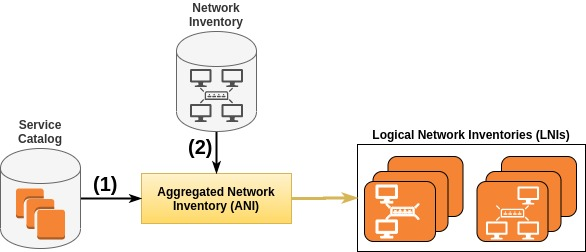
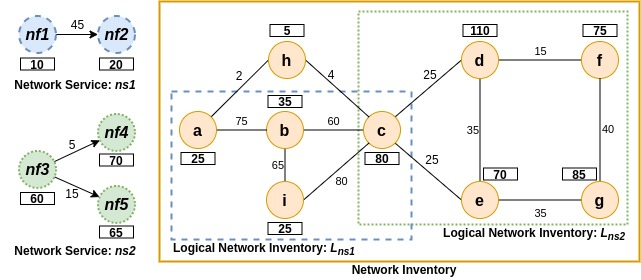

# Abstracted Network Inventory (ANI)

The Abstracted Network Inventory (ANI) component proactively constructs multiple network views over the same network infrastructure, called Logical Network Inventories (LNIs). Each LNI is optimized to a service in terms of its requirements such as CPU, memory, latency, etc. Every new service in a catalog triggers the creation of another LNI that will be part of the optimized network inventory. As such, service requirements are used in the method to guide the right level of abstraction.

## 1. LNI Generation



*Figure 1: Logical Network Inventory (LNI) generation.*

**INPUTS:**
- (1) Network services requirements from a catalog.
- (2) Network representation from a network inventory.

**OUTPUT:**
- Logical Network Inventory (LNI): Service-optimized network views over the same network inventory.

## 2. Network Model:

- **Network Service:** We model a network service as a directed graph denoted by G<sub>s</sub> = (V<sub>s</sub>, E<sub>s</sub>).

- **Network Inventory:** In its basic form, a network inventory is modeled as an undirected graph G<sub>i</sub> = (V<sub>i</sub>, E<sub> i</sub>). In order to support graph collections, our network inventory model is extended to include a set of LNI graphs
G<sub>i</sub> = (V<sub>i</sub>, E<sub>i</sub>, **LNI<sub>i</sub>**), where **LNI<sub>i</sub>** represents multiple possible views of the same network inventory.

Given a service request G<sub>s</sub> = (V<sub>s</sub>, E<sub>s</sub>) and a network inventory G<sub>i</sub> = (V<sub>i</sub>, E<sub>i</sub>, LNI<sub>i</sub>), our objective is to determine a LNI graph L<sub>l</sub> ∈ LNI<sub>i</sub> optimized for the service requirements in terms of vertex and edge constraints. We illustrate our problem statement with an example given in Figure 2.



*Figure 2: An example of Network Service & Network Inventory
& Logical Network Inventory (LNI).*

The left side of this figure shows two network services, where the numbers in rectangles represent requested CPU capacity, and the numbers near the links represent required bandwidth capacity. The network service 1 (ns1) connects two NFs (nf1 and nf2) with 45 units of bandwidth on the edge between them. The network service 2 (ns2) requires the bandwidth 5 over the edge (nf2, nf4) and 15 units over the edge (nf3, nf5), and the CPU resources 60, 70, 65 at NFs nodes, nf3, nf4, and nf5, respectively.

Figure 2 (right side) also depicts a network inventory. The number near the links is the available bandwidth, and the numbers in rectangles represent the available CPU resources at the vertices. Once the process of determining an LNI is performed, the network inventory contains two logical graphs LNI<sub>i</sub> = {L<sub>ns1</sub>, L<sub>ns2</sub>}, where each graph has a dedicated subset of vertices and edges, which represent an optimized network view to the requirements of each network service. Note that also a vertex (v<sub>c</sub>) is overlapped since V(L<sub>ns1</sub> ) ∩ V(L<sub>ns2</sub>) = {v<sub>c</sub> }.

## 3. Proposed Algorithms

The primary objective here is to design three algorithms that efficiently create LNIs. The ANI component considers three modes of LNIs generation:

- **Node-oriented LNI:** A set of nodes in the network inventory are assigned to the LNI (links are discarded). Such selected nodes have to support the CPU capacity constraint of NF nodes in a service (See [pseudo-code](figures/alg/node-lni.png)).

- **Edge-oriented LNI:** A set of edges in the network inventory are assigned to the LNI. Selected edges have to support the required bandwidth capacity of edges in a service (See [pseudo-code](figures/alg/edge-lni.png)).

- **Node/Edge-oriented LNI:** A set of nodes and edges in the network inventory are assigned to the LNI. Nodes and edges are selected according to the CPU and bandwidth capacity constraints in a service, respectively (See [pseudo-code](figures/alg/node-edge-lni.png)).

## 4. Experimental Evaluation

### 4.1 LNI Quality Evaluation

#### 4.1.1 Node and Edge reduction
```sh
$ cd lni-quality/
$ sudo python virt_gen.py
```

#### 4.1.2 Average degree
```sh
$ cd lni-quality-vnf/
$ sudo python virt_gen_vnf.py
```

### 4.2 LNI impact on service provisioning time
```sh
$ cd lni-time-save/
$ sudo virt_gen_vnf_topo.py
```
